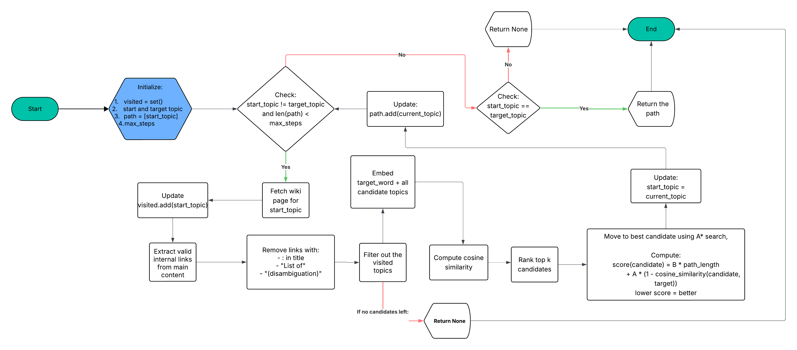

# WikiWord – Wikipedia Path Navigator

WikiWord is an intelligent Wikipedia navigation tool that finds paths between two topics by following internal links and using semantic similarity to select the most relevant next article.

## Overview

WikiWord demonstrates an interesting approach to graph traversal on Wikipedia: starting from a source topic, it uses BERT embeddings and cosine similarity to intelligently select which internal links to follow in order to reach a target topic as efficiently as possible.

## Features

- **Smart Topic Selection**: Uses Sentence-BERT embeddings to compute semantic similarity between candidate links and target topic
- **Intelligent Link Filtering**: Removes disambiguation pages and special pages automatically
- **Robust Web Scraping**: Handles timeouts, retries, and user-agent rotation when fetching Wikipedia pages
- **Link Caching**: Avoids redundant API calls by caching previously fetched pages
- **Random Topic Generation**: Automatically selects random start/end topics from a predefined list

## Workflow



## Project Structure

```
WikiWord/
├── run.py                    # Main entry point - orchestrates navigation
├── crawler.py               # Fetches Wikipedia pages & extracts internal links
├── select_topics.py         # Randomly selects start/end topics
 extraction utility
├── topics.txt               # List of 30 Wikipedia topics to choose from
├── requirements.txt         # Python dependencies
└── README.md                # Instruction to use and Workflow
```

## Installation

1. **Clone the repository**:
   ```bash
   git clone https://github.com/Uni-Creator/WikiWord.git
   cd WikiWord
   ```

2. **Create a virtual environment** (recommended):
   ```bash
   python -m venv venv
   source venv/bin/activate  # On Windows: venv\Scripts\activate
   ```

3. **Install dependencies**:
   ```bash
   pip install -r requirements.txt
   ```

## Usage

### Basic Run (Random Topics)

```bash
python run.py
```

This will:
- Randomly select a start topic and end topic from `topics.txt`
- Navigate from start to end using semantic similarity
- Print each step of the path found

### Example Output

```
Start Topic: Barack Obama
End Topic: Quantum mechanics

Step 1: Barack Obama -> Quantum mechanics
Best match: Nobel Prize (score=0.5234)
Step 2: Nobel Prize -> Quantum mechanics
Best match: Physics (score=0.6891)
Step 3: Physics -> Quantum mechanics
Best match: Quantum mechanics (score=0.9187)
Target reached.

Final Path:
1. Barack Obama
2. Nobel Prize
3. Physics
4. Quantum mechanics
```

### Customize Topics

Edit `topics.txt` to add or replace topics (one per line). The script will randomly pick two from this list.

### Modify Navigation Parameters

In `run.py`, adjust:
- `max_steps`: Maximum number of hops allowed (default: 15)
- `model`: Change to `'all-mpnet-base-v2'` for higher accuracy (slower), or `'all-MiniLM-L6-v2'` for speed

## How It Works

1. **Topic Selection** (`select_topics.py`):
   - Loads topics from `topics.txt`
   - Randomly picks two distinct topics

2. **Page Fetching** (`crawler.py`):
   - Uses Wikipedia API to fetch metadata (title, summary)
   - Scrapes HTML to extract all internal links
   - Filters out disambiguation pages and special pages
   - Deduplicates links

3. **Semantic Navigation** (`run.py`):
   - Encodes target page metadata using Sentence-BERT
   - For each candidate link: encodes link text and computes cosine similarity
   - Follows the link with highest similarity to target
   - Repeats until target is reached or max steps exceeded

## Dependencies

| Package | Purpose |
|---------|---------|
| `beautifulsoup4` | HTML parsing for link extraction |
| `requests` | HTTP requests to Wikipedia |
| `wikipedia-api` | Wikipedia API wrapper |
| `sentence-transformers` | Word embeddings for semantic similarity |
| `numpy` | Numerical operations |
| `scikit-learn` | Cosine similarity computation |

## Performance Notes

- **First run**: Downloads all-MiniLM-L2-v2 model (~100MB), may take a few seconds
- **Subsequent runs**: Model is cached locally
- **Network**: Fetching each Wikipedia page takes ~1-2 seconds due to I/O
- **Navigation speed**: 15 steps typically completes in 30-60 seconds

## Troubleshooting

### "403 Forbidden" errors
- The script includes proper User-Agent headers; if errors persist, increase the `timeout` parameter in `crawler.py`

### "No internal links remaining"
- Some Wikipedia pages have few internal links. Try different start/end topics

### Memory issues
- You can use larger models but if you hit OOM on large embeddings, switch to a smaller model like `'all-MiniLM-L6-v2'` (already default)

## Future Enhancements

- [ ] BFS/Dijkstra path finding for guaranteed shortest paths
- [ ] Caching at the graph level (store link graph locally)
- [ ] Multi-threaded fetching for faster link retrieval
- [ ] Web UI to visualize paths
- [ ] Support for other Wikipedia languages
- [ ] Add more topics in json format for more readability

## License

MIT License - see LICENSE file for details

## Author

Created by Abhay ([uni.creator001@gmail.com](mailto:uni.creator001@gmail.com))

## Contributing

Contributions welcome! Please open an issue or pull request with improvements.
